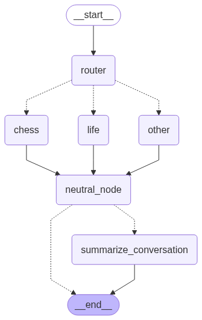

# ♟️ Multi-Turn Chess & Life Chatbot

This project is a conversational chatbot that can answer chess questions, give life advice, and handle general queries. It uses [LangGraph](https://python.langchain.com/docs/langgraph/) to manage multi-turn conversation flows, memory, and summarization, and [Streamlit](https://streamlit.io/) for the user interface.

---

## 🧠 **LangGraph Workflow Overview**

The chatbot is built as a **stateful graph** where each node represents a step in the conversation logic. The workflow is:

1. **Router Node**: Classifies the user's message as 'chess', 'life', or 'other' using an LLM call.
2. **Category Nodes**: Specialized nodes generate responses tailored to the detected category:
    - `call_model_chess`: Chess expert persona
    - `call_model_life`: Supportive friend persona
    - `call_model_other`: General helpful assistant
3. **Neutral Node**: Passes state through, allowing for flexible graph expansion.
4. **Summarization Node**: Periodically summarizes the conversation to keep context concise and relevant.
5. **Conditional Routing**: After each response, the graph checks if summarization is needed or if the conversation should end.

<p align="center">
  
</p>

- **Router**: Classifies the message and routes to the appropriate node.
- **Category Nodes**: Generate context-aware responses.
- **Neutral**: Placeholder for extensibility.
- **Summarize**: Maintains a running summary for long conversations.

---

## 🏗️ **LangGraph Techniques Used**

### 1. **Conditional Edges**
- Used to route between nodes based on LLM classification or conversation length.
- Example: After the router, the next node is chosen based on the detected category.

### 2. **Stateful Memory (Checkpointer)**
- Uses `MemorySaver` (or `SqliteSaver`) to persist conversation state (messages, summary, etc.) per session/thread.
- Enables the chatbot to recall previous exchanges even if only the latest message is passed in.

### 3. **Summarization Node**
- Periodically summarizes the conversation to keep the context window manageable for the LLM.
- Only the most recent messages and the summary are kept after summarization.

### 4. **Persona-Specific Prompting**
- Each category node uses a specialized system prompt to tailor the LLM's behavior (chess expert, life coach, general assistant).

### 5. **Threaded Sessions**
- Each conversation is associated with a `thread_id` so that memory can persist across different graph calls.

---

## 💻 **How the Streamlit App Works**

- The Streamlit UI collects user input and displays the conversation history.
- On each user message, the app:
    1. Builds the full message history from session state.
    2. Calls the LangGraph workflow with the current `thread_id`.
    3. Updates the chat history with the new response.
- The app preserves memory and context across turns.

---

## 🚀 **Usage**

1. **Install dependencies:**
   ```bash
   pip install -r requirements.txt
   ```
2. **Run the Streamlit app:**
   ```bash
   streamlit run multi_turn_chat/app.py
   ```
3. **Chat!**
   - Ask chess questions, life advice, or anything else.
   - The bot will remember details and context as the conversation progresses.
